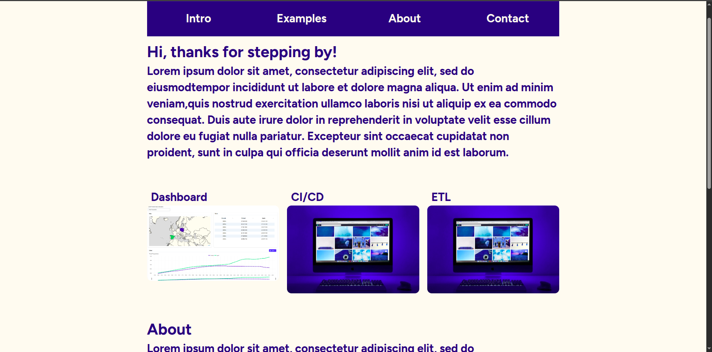
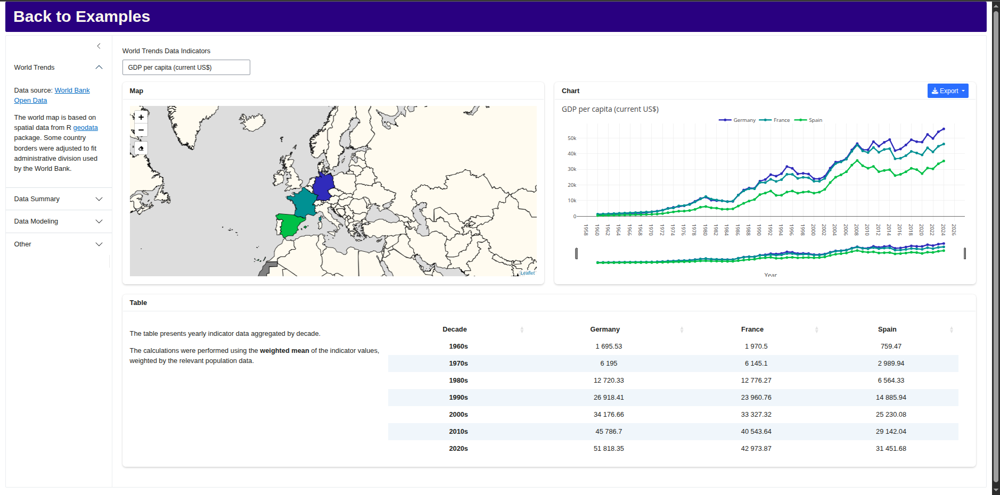

# My R Shiny Portfolio

An interactive personal portfolio built as a production-grade R package with Shiny — showcasing data science, visualization, and analytical projects.

**Live Demo:** [Coming soon — development and deployment in progress]


---

## Preview




---

## About This Project

This portfolio is an interactive R Shiny web application — and a demonstration of skills in itself. Rather than a static website, it is built with the same tools and standards used in real client projects: interactive maps, dynamic charts, database connectivity, and a modular UI.

What sets this project apart is its engineering approach. The app is structured as a **proper R package** (`myportfolio`), complete with a `DESCRIPTION` file, Shiny modules, a full `testthat` test suite, CI scripts, and `renv` for reproducible dependency management.

---

## Current Status

**Work in progress.**

| Section                             | Status      |
| ----------------------------------- | ----------- |
| Main Page                           | In progress |
| Examples - Dashboard - World Trends | Done        |
| Examples - Dashboard - Other        | Planned     |
| Examples - CI/CD                    | In progress |
| Examples - ETL                      | Planned     |
| Examples - Python                   | Planned     |

---

## Features (completed)

- Responsive layout built with `bslib`, tailored HTML/CSS and custom JavaScript code.
- Data fetching from MySQL database using `DBI`, `RMariaDB` and `glue`.
- Interactive data visualization samples using `leaflet`, `plotly` and `DT`.
- Dynamic data filtering and aggregation (`data.table`), and UI controls.
- Package structure, custom functions, modules and `R6` classes, and unit tests (`testthat`).
- Reproducible environment (`renv`) and multi stage Docker image build.

## Planned Features

- "Data Summary" and "Data Modeling" examples.
- Utilizing other statistical (e.g. `tidymodels`) and visualization tools (e.g. `ggplot2`).
- Working CI/CD and ETL pipelines.

---

## Tech Stack

| Tool                  | Purpose                           |
| --------------------- | --------------------------------- |
| R + Shiny             | Core framework                    |
| `data.table`          | Fast data manipulation            |
| `DBI` + `RMariaDB`    | Database connectivity (MariaDB)   |
| `dplyr` / `tidyr`     | Data wrangling                    |
| `DT`                  | Interactive data tables           |
| `future` + `promises` | Async / non-blocking operations   |
| `ggplot2`             | Static visualizations             |
| `glue`                | String interpolation              |
| `jsonlite`            | JSON parsing and serialization    |
| `leaflet`             | Interactive maps                  |
| `magrittr`            | Pipe operators                    |
| `plotly`              | Interactive charts                |
| `sf`                  | Spatial data handling             |
| `shinycssloaders`     | Loading spinners and async UX     |
| `shinyWidgets`        | Enhanced UI components            |
| Python                | Data processing and scripting     |
| SQL                   | Database queries and data storage |

---

## Run Locally

It is not possible to run the app locally without relevant ".env" files.

---

## Project Structure

```
├── DESCRIPTION                        # Package metadata and dependencies
├── NAMESPACE                          # Exported functions (auto-generated)
├── NEWS.md                            # Changelog
├── LICENSE / LICENSE.md               # License information
├── Makefile                           # Dev workflow shortcuts (run, test, lint)
├── Dockerfile                         # Container definition for deployment
├── renv.lock                          # Exact dependency snapshot
├── renv/                              # Reproducible R environment
├── myportfolio.Rproj                  # RStudio project file
│
├── R/                                 # Core package source code - functions, modules and classes
│
├── inst/shiny/                        # Shiny application (shipped with package)
│   ├── app.R                          # App entry point
│   ├── global.R                       # Global setup and data loading
│   ├── ui.R                           # Top-level UI definition
│   ├── server.R                       # Top-level server definition
│   ├── components/                    # Page-level UI and server modules
│   │   ├── main/                      # Landing / main page
│   │   ├── dashboard/                 # Dashboard page (charts, maps, summaries)
│   │   ├── cicd/                      # CI/CD showcase page
│   │   └── etl/                       # ETL showcase page
│   └── www/                           # Static assets
│       ├── css/                       # Stylesheets (grid, variables, per-page styles)
│       ├── js/                        # JavaScript (dashboard events)
│       ├── images/                    # UI images and social icons
│       └── lib/leaflet/               # Bundled Leaflet.js library
│
├── man/                               # Auto-generated roxygen2 documentation
│
├── tests/                             # Automated tests
│
├── ci/                                # CI pipeline scripts
│   ├── unittests.R                    # Run unit tests
│   ├── coverage.R                     # Code coverage report
│   └── lint.R                         # Code linting (lintr)
│
└── scripts/                           # Utility scripts
    └── create_sftp_config.py          # SFTP configuration setup (Python)
```

---

## Contact

I’m open to freelance opportunities focused on R Shiny applications and end-to-end data dashboard solutions, including design, development, and maintenance.

- **Malt:** [Jacek Cieslar](https://www.malt.com/profile/jacekcieslar)
- **Upwork:** [Jacek Cieslar](https://www.upwork.com/freelancers/~01dcdac8f2ee9cfc3f?mp_source=share)
- **Email:** contact@jacekdev.com
- **LinkedIn:** [Jacek Cieslar](https://www.linkedin.com/in/jacekcieslar-a08063a9/)

---

_This project is a portfolio demonstration and is actively being developed._
